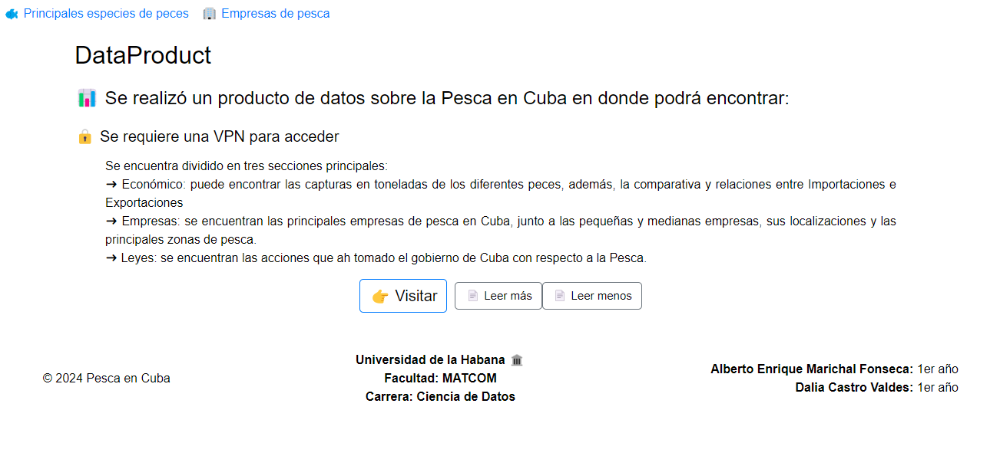
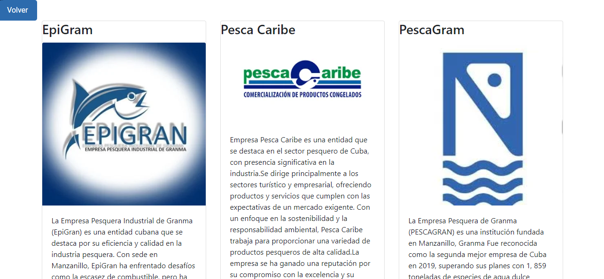
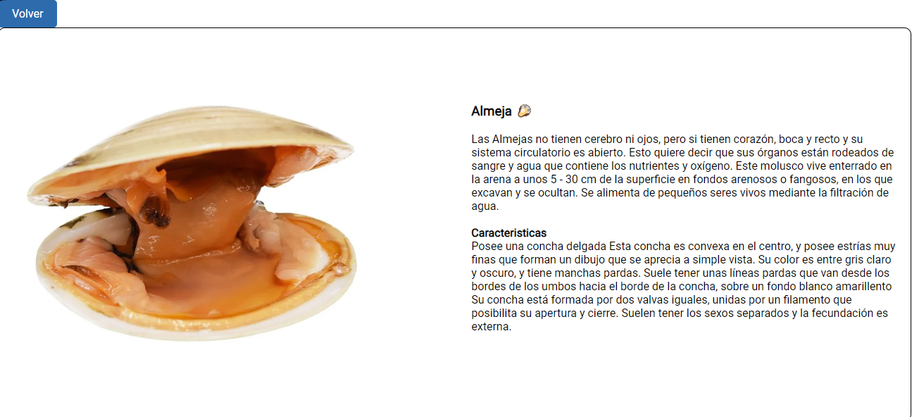

# 📊 La Pesca en Cuba

Se ha desarrollado un **producto de datos** sobre la pesca en Cuba, donde podrás descubrir información relevante y actualizada:

🔒 **Acceso**: Para acceder al contenido, se requiere el uso de una VPN.

## Secciones Principales

## Conclusión

Este proyecto no solo tiene como objetivo informar, sino también inspirar un mayor interés por la pesca sostenible y el desarrollo del sector pesquero en Cuba. 🌊🐟 A través de un análisis detallado y accesible, esperamos contribuir a la conversación sobre la importancia de este recurso vital para la economía y la cultura cubana.
